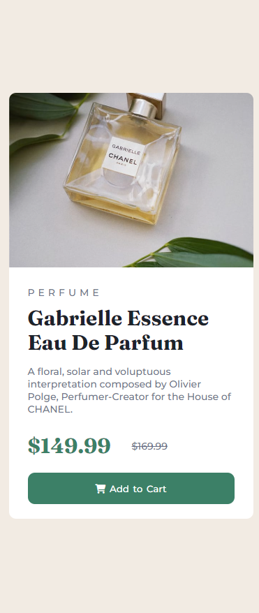

# Frontend Mentor - Product preview card component solution

This is a solution to the [Product preview card component challenge on Frontend Mentor](https://www.frontendmentor.io/challenges/product-preview-card-component-GO7UmttRfa). Frontend Mentor challenges help you improve your coding skills by building realistic projects. 

## Table of contents

- [Overview](#overview)
  - [The challenge](#the-challenge)
  - [Screenshot](#screenshot)
  - [Links](#links)
- [My process](#my-process)
  - [Built with](#built-with)
  - [What I learned](#what-i-learned)
- [Author](#author)

## Overview

### The challenge

Users should be able to:

- View the optimal layout depending on their device's screen size
- See hover and focus states for interactive elements

### Screenshot

```html


 ```

### Links

- Solution URL: [Add solution URL here](https://your-solution-url.com)

## My process

I started by looked at designs to see what should it look like. After that I added the tags in index.html to have the layout of the card. From there I started the trial and error process of my css to make it look as close to the design as I could. Nothing in particularly very difficult and I'm happy about the result. I don't think is perfect in anyway and I'm sure there is a better way, but for now I'm proud.

### Built with

- Semantic HTML5 markup
- CSS custom properties
- Flexbox

### What I learned

In this practice project I learned how to responsivly load images, based on the viewport of the window using

```html
<picture>
  <source>
  
</picture>
```

## Author

- Frontend Mentor - [@mihaiches](https://www.frontendmentor.io/profile/mihaiches)
